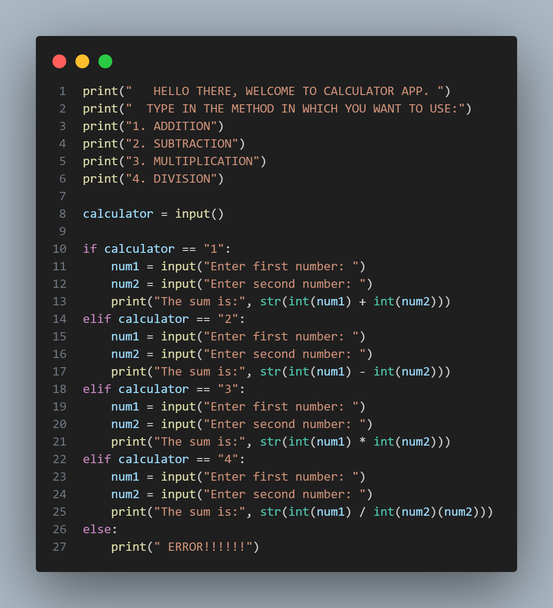

## calculator-app
I followed some video tutorials and made a few steps:
1. I printed the methods in math with numbers before them(1-4): print("1. ?????")
2. I created a variable and put the method input() in it
3. Then i made an if statement with the variable for the number '1' in a string, then inside the if statement i made two more variables, in the first variable, i made the user enter their first with the input() method and in the second variable, i made the user enter their second number with the input() method. Then i added the two variables together( + ) 
4. Then i made an elif statement with the variable for the  number'2', then did the same thing i did in the if statement(three times), but with different methods( - , * , / )(subtraction, multiplication and addition) and different numbers(2, 3, 4).
Then i made an else statement to print something like 'error'

   
   But i also had some challenges like:
1. In the 1st variable i made for string'1', when i was doing the if statement, when i put an '=' before string '1', the '=' was meant to be '=='(a double equal to)
2. When i was adding, subtracting multiplying and dividing, the second variable i made was meant to be like  this; str(int(num1)),      and the third variable i made was meant to be int(num2)

